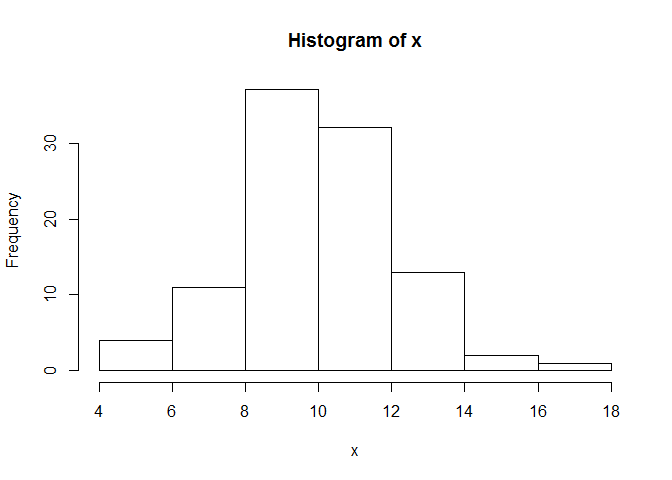
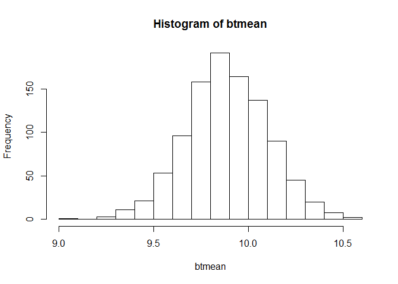
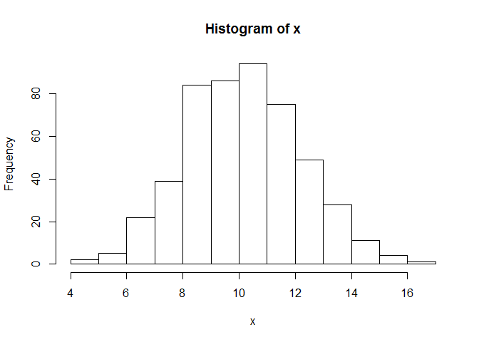
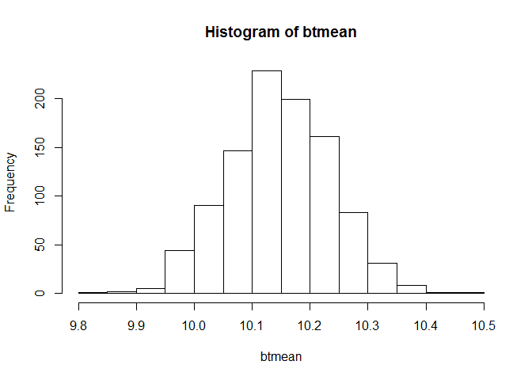
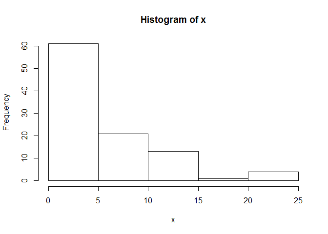
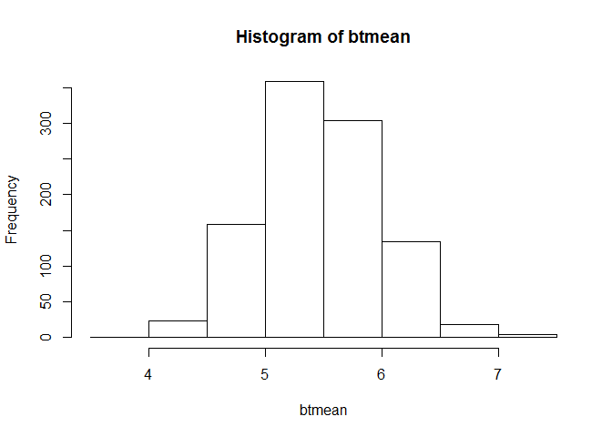
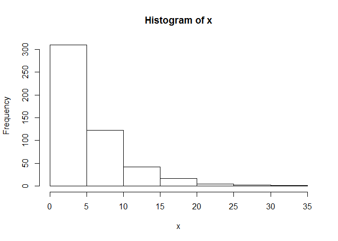
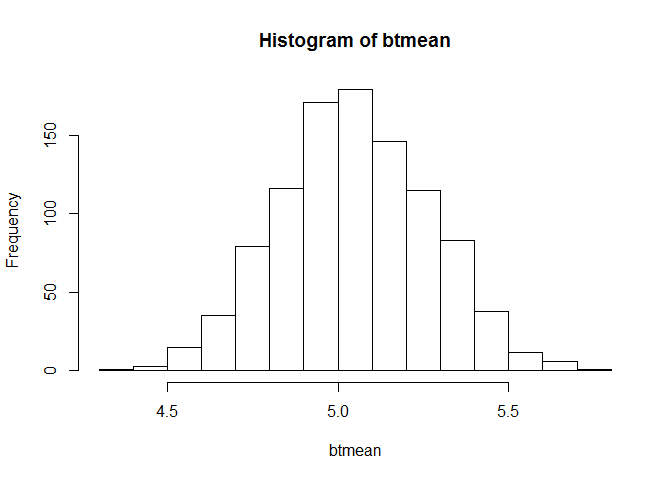

# Bootstrap_Exercise
Vivek Bejugama  
October 19, 2016  


Knitting External Bootstrap R Code to Illustrate the Central Limit 

```r
knitr::read_chunk("C://Users//vivek//Documents//R//R_Script//BootStrap.R")
```

## Test 1 : Normal Distribution of Size 100  
#####  The results below are in tune with central limit theorem for normal distributed population size 100. The Population mean is equal to the mean of the 1000 randomly selected samples from the population and the sample means are normally distributed. 
  

```r
# Normal dist of sample size 100
x <- rnorm(100,10,2)	# Generating normaly distributed 100 samples, with mean 10 and SD 2
hist(x)			# Histrogram of the sample generated
```

<!-- -->

```r
mean(x)  		# True mean of the sample
```

```
## [1] 9.878332
```

```r
sd(x)  			# True SD of the sample
```

```
## [1] 2.143596
```

```r
sd(x)/sqrt(length(x))	# Expected SD of SRS 
```

```
## [1] 0.2143596
```

```r
R <- 1000		# Initializing # of repitations to 1000
btmean <- numeric(R)	# Initializing btmean to capture SRS means
btsd <- numeric(R)	# Initializing btsd to capture SRS SD	
for(i in 1:R){		# Loop to apply bootstrap techhnique to generate SRS means and SD	
  new_sample <- sample(x, length(x),TRUE)
  btmean[i] <- mean(new_sample)
  btsd[i] <- sd(new_sample)
}
hist(btmean)   		# Sample Means are normaly distributed
```

<!-- -->

```r
mean(btmean)   		# Mean of the sample Means is equal to the true mean
```

```
## [1] 9.887648
```

```r
sd(btmean)     		# SD of sample means is equal to the true SD/squre root of sample size
```

```
## [1] 0.217505
```
  

## Test 2 : Normal Distribution of Size 500
#####  The results below are in tune with central limit theorem for normal distributed population size 500. The Population mean is equal to the mean of the 1000 randomly selected samples from the population and the sample means are normally distributed.

```r
# Normal dist of sample size 500
x <- rnorm(500,10,2)	# Generating normaly distributed 500 samples, with mean 10 and SD 2
hist(x)			# Histrogram of the sample generated
```

<!-- -->

```r
mean(x)  		# True mean of the sample
```

```
## [1] 10.14448
```

```r
sd(x)  			# True SD of the sample
```

```
## [1] 2.039072
```

```r
sd(x)/sqrt(length(x))	# Expected SD of SRS 
```

```
## [1] 0.09119006
```

```r
R <- 1000		# Initializing # of repitations to 1000
btmean <- numeric(R)	# Initializing btmean to capture SRS means
btsd <- numeric(R)	# Initializing btsd to capture SRS SD	
for(i in 1:R){		# Loop to apply bootstrap techhnique to generate SRS means and SD	
  new_sample <- sample(x, length(x),TRUE)
  btmean[i] <- mean(new_sample)
  btsd[i] <- sd(new_sample)
}
hist(btmean)   		# Sample Means are normaly distributed
```

<!-- -->

```r
mean(btmean)   		# Mean of the sample Means is equal to the true mean
```

```
## [1] 10.14671
```

```r
sd(btmean)     		# SD of sample means is equal to the true SD/squre root of sample size
```

```
## [1] 0.08854923
```

## Test 3 : Exponential Distribution of Size 100
#####  The results below are in tune with central limit theorem for exponential distributed population size 100. The Population mean is equal to the mean of the 1000 randomly selected samples from the population and the sample means are normally distributed even though the population is not.

```r
# Exp dist of sample size 100
x <- rexp(100,0.2)	# Generating exponential distribution of 100 samples with rate 0.2
hist(x)			# Histrogram of the Exponential sample generated. 
```

<!-- -->

```r
mean(x)  		# True mean of the sample
```

```
## [1] 5.458353
```

```r
sd(x)  			# True SD of the sample
```

```
## [1] 5.269478
```

```r
sd(x)/sqrt(length(x))	# Expected SD of SRS 
```

```
## [1] 0.5269478
```

```r
R <- 1000		# Initializing # of repitations to 1000
btmean <- numeric(R)	# Initializing btmean to capture SRS means
btsd <- numeric(R)	# Initializing btsd to capture SRS SD	
for(i in 1:R){		# Loop to apply bootstrap techhnique to generate SRS means and SD	
  new_sample <- sample(x, length(x),TRUE)
  btmean[i] <- mean(new_sample)
  btsd[i] <- sd(new_sample)
}
hist(btmean)   		# Sample Means are normaly distributed, though the parent sample is exponential
```

<!-- -->

```r
mean(btmean)   		# Mean of the sample Means is equal to the true mean
```

```
## [1] 5.475339
```

```r
sd(btmean)     		# SD of sample means is equal to the true SD/squre root of sample size
```

```
## [1] 0.5135996
```

## Test 4 : Exponential Distribution of Size 500
#####  The results below are in tune with central limit theorem for exponential distributed population size 100. The Population mean is equal to the mean of the 1000 randomly selected samples from the population and the sample means are normally distributed even though the population is not.

```r
# Exp dist of sample size 500
x <- rexp(500,0.2)	# Generating exponential distribution of 500 samples with rate 0.2
hist(x)			# Histrogram of the Exponential sample generated. 
```

<!-- -->

```r
mean(x)  		# True mean of the sample
```

```
## [1] 5.054393
```

```r
sd(x)  			# True SD of the sample
```

```
## [1] 4.868117
```

```r
sd(x)/sqrt(length(x))	# Expected SD of SRS 
```

```
## [1] 0.2177088
```

```r
R <- 1000		# Initializing # of repitations to 1000
btmean <- numeric(R)	# Initializing btmean to capture SRS means
btsd <- numeric(R)	# Initializing btsd to capture SRS SD	
for(i in 1:R){		# Loop to apply bootstrap techhnique to generate SRS means and SD	
  new_sample <- sample(x, length(x),TRUE)
  btmean[i] <- mean(new_sample)
  btsd[i] <- sd(new_sample)
}
hist(btmean)   		# Sample Means are normaly distributed, though the parent sample is exponential
```

<!-- -->

```r
mean(btmean)   		# Mean of the sample Means is equal to the true mean
```

```
## [1] 5.050238
```

```r
sd(btmean)     		# SD of sample means is equal to the true SD/squre root of sample size
```

```
## [1] 0.2204671
```

